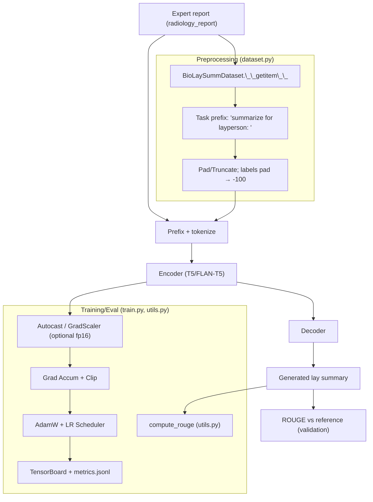
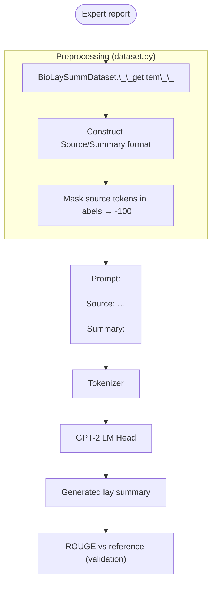
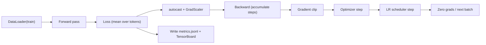

# Expert Radiology Report to Layperson Summary (BioLaySumm)
This project fine‑tunes a pretrained language model to translate expert radiology reports into layperson summaries using the BioLaySumm dataset (ACL 2025). It implements encoder–decoder models (T5/FLAN‑T5) and decoder‑only models (GPT‑2), optional parameter‑efficient fine‑tuning (LoRA), and evaluates on a held‑out split with ROUGE (rouge1, rouge2, rougeL, rougeLsum).

## Models supported
- Encoder–decoder (recommended):
    - FLAN‑T5: `google/flan-t5-small`, `google/flan-t5-base` (tested), `google/flan-t5-large` (heavier)
    - T5: `t5-small`, `t5-base`, `t5-large`
- Decoder‑only (prompted summarization):
    - GPT‑2 family: `gpt2`, `gpt2-medium` (requires source & summary prompting)
- Parameter‑efficient fine‑tuning (optional):
    - LoRA via PEFT (`--lora_r 8` etc.), to reduce trainable parameters and VRAM usage

## Architecture overview
Encoder–decoder (T5/FLAN‑T5):
- Input to encoder: `"summarize for layperson: " + radiology_report`
- Decoder generates the lay summary. Labels mask padding tokens with −100 for loss.
Decoder‑only (GPT‑2):
- Prompt: `"Source: <report>\n\nSummary: "` (no target in prompt at inference)
- Labels mask the source tokens (−100) so loss applies only to the summary span.

Conceptual flow:


### Detailed architecture and code map
Below are implementation‑level diagrams including exact file/function pointers for clarity.
#### Encoder–decoder pipeline (T5/FLAN‑T5)


#### Decoder‑only pipeline (GPT‑2)



Masking details
- Pad tokens in labels are set to −100 so the loss ignores them.
- For GPT‑2, all “Source:” tokens are masked to −100; only the “Summary:” span contributes to loss.

#### Training loop anatomy



Decoding strategies (where set)
- Beam search: `--eval_num_beams` in `train.py` and `--num_beams` in `predict.py` forwarded to `model.generate`.
- Max output length: `--eval_max_new_tokens`/`--max_new_tokens`.

#### LoRA integration

- Enabled by passing `--lora_r` (and optional `--lora_alpha`, `--lora_dropout`).
- Applied in `modules.py::prepare_model_for_training(...)` via PEFT, adapting attention/FFN modules per backbone defaults while keeping base weights frozen for efficiency.

### Figures and diagrams
- Generated training figures live under `runs/<project>/figures/` by default: `loss.png`, `rougeL.png`, `rouge_all.png`.

## File Overview
- `dataset.py`
    - `BioLaySummDataset.__getitem__`: builds encoder inputs with prefix and target labels; masks pad tokens to −100 so they’re ignored by loss.
    - `get_dataloaders(...)`: returns train/val/test DataLoaders.
- `modules.py`
    - `load_model_and_tokenizer(...)`: loads model/tokenizer; sets pad token for GPT‑2; can enable grad checkpointing/8‑bit.
    - `prepare_model_for_training(...)`: applies LoRA/freezing when requested.
    - `create_optimizer(...)`, `create_scheduler(...)`: AdamW + linear/cosine schedule.
- `train.py`
    - Full training loop with optional mixed precision, gradient accumulation/clipping, checkpointing to `runs/<project>/`.
    - Writes `metrics.jsonl`, per‑epoch `epochK/metrics.json`, `training_summary.json` and TensorBoard logs under `runs/<project>/tb`.
- `utils.py`
    - `format_input_text(...)`: constructs the task‑prefixed input for inference.
    - `decode_labels(...)`: converts −100 back to pad for decoding references.
    - `compute_rouge(...)`: decoding + Evaluate(ROUGE) with FP16 safety.
- `plots.py`: turns `metrics.jsonl` into `loss.png`, `rougeL.png`, `rouge_all.png`.
## Project Structure
## Dataset (Hugging Face)
The `BioLaySumm/BioLaySumm2025-LaymanRRG-opensource-track`dataset is automatically downloaded using the Hugging Face library. Data loading is handled in `dataset.py` via `load_dataset()` function. More details:
- Fields used:
    - Source (expert): `radiology_report`
    - Target (lay): `layman_report`
- Splits: `train`, `validation`, `test` (used as‑is for clean comparison and unbiased evaluation).

Pre‑processing steps taken:
- Encoder–decoder: prepend task prefix, truncate/pad to `max_source_length`/`max_target_length`, and set label pads to −100.
- Decoder‑only: construct `"Source: ...\n\nSummary: ...<eos>"`, mask source and pad tokens to −100 in labels.

## Setup
PowerShell (Windows):
```powershell
cd "recognition/LLMFineTuning"
python -m venv .venv
.\.venv\Scripts\Activate.ps1
python -m pip install --upgrade pip
python -m pip install -r .\requirements.txt
```

Linux/macOS:
```bash
cd recognition/LLMFineTuning
python3 -m venv .venv
source .venv/bin/activate
python -m pip install --upgrade pip
python -m pip install -r ./requirements.txt
```

Optional (Linux):
```bash
# CUDA-enabled PyTorch (match to your CUDA per pytorch.org)
# python -m pip install torch --index-url https://download.pytorch.org/whl/cu121
# 8‑bit for LoRA (Linux):
# python -m pip install bitsandbytes
```

## Train

Full fine‑tune (no fp16) on FLAN‑T5 base:

Windows (PowerShell):
```powershell
python .\train.py `
    --model_name google/flan-t5-base `
    --output_dir .\runs\project13 `
    --epochs 3 `
    --batch_size 8 `
    --max_source_length 512 `
    --max_target_length 256 `
    --eval_num_beams 4 `
    --eval_max_new_tokens 128 `
    --eval_test_after_train
```

Linux/macOS:
```bash
python ./train.py \
    --model_name google/flan-t5-base \
    --output_dir ./runs/project13 \
    --epochs 3 \
    --batch_size 8 \
    --max_source_length 512 \
    --max_target_length 256 \
    --eval_num_beams 4 \
    --eval_max_new_tokens 128 \
    --eval_test_after_train
```

LoRA (parameter‑efficient): add e.g. `--lora_r 8` (and optionally `--lora_alpha 32 --lora_dropout 0.1`).

Outputs
- Best checkpoint: `runs/<project>/best/`
- Per‑epoch checkpoints: `runs/<project>/epochK/`
- Metrics: `runs/<project>/metrics.jsonl`, `runs/<project>/epochK/metrics.json`
- Training summary (GPU, VRAM, epochs, total time, strategy): `runs/<project>/training_summary.json`
- If enabled: test metrics at end of epoch(s): `runs/<project>/test_metrics.json` and `runs/<project>/best/test_metrics.json`

## Evaluate and sample predictions

Evaluate a checkpoint on a split and save samples:

Windows (PowerShell):
```powershell
python .\predict.py `
    --model_path .\runs\project13\best `
    --split test `
    --batch_size 8 `
    --num_beams 4 `
    --max_new_tokens 128 `
    --samples 5 `
    --metrics_out .\runs\project13\test_metrics.json `
    --samples_out .\runs\project13\pred_samples.jsonl
```

Linux/macOS:
```bash
python ./predict.py \
    --model_path ./runs/project13/best \
    --split test \
    --batch_size 8 \
    --num_beams 4 \
    --max_new_tokens 128 \
    --samples 5 \
    --metrics_out ./runs/project13/test_metrics.json \
    --samples_out ./runs/project13/pred_samples.jsonl
```

`predict.py` prints a JSON block (ROUGE, parameter counts, generation args) and prints/saves a few Source/Pred/Ref examples.

## TensorBoard (live metrics)
Training writes event logs to `runs/<project>/tb`.

- Windows (PowerShell):
    ```powershell
    tensorboard --logdir .\runs\project13\tb --port 6006
    ```
- Linux/macOS:
    ```bash
    tensorboard --logdir ./runs/project13/tb --port 6006
    ```

- train/loss, train/lr over steps
- val/loss and val/ROUGE per epoch
- (if enabled) test/ROUGE metrics

## Plots and figures

Generate static plots from `metrics.jsonl`:

Windows:
```powershell
python .\plots.py --run_dir .\runs\project13 --out_dir .\runs\project13\figures
```
Linux/macOS:
```bash
python ./plots.py --run_dir ./runs/project13 --out_dir ./runs/project13/figures
```

Saves `loss.png`, `rougeL.png`, and `rouge_all.png` 

## Reproducibility
- Fixed seed is used by default (`--seed 42`), but perfect determinism across machines/GPUs is not guaranteed.
- Use the same model/tokenizer and lengths across train/eval, and record environment.

## What to include

- ROUGE on held‑out test split: from `test_metrics.json` (rouge1, rouge2, rougeL, rougeLsum)
- Model and parameter count: printed by `predict.py` (total/trainable)
- Fine‑tuning strategy: full vs LoRA (see `training_summary.json`)
- GPU type, VRAM, epochs, total training time: in `training_summary.json`
- 3–5 representative input–output examples: `pred_samples.jsonl` (add a short error analysis paragraph)

## TODO placeholders 

- [ ] Qualitative examples (3–5): `runs/<project>/pred_samples.jsonl`
- [ ] Loss curve image: `runs/<project>/figures/loss.png`
    - 
- [ ] ROUGE‑L over epochs: `runs/<project>/figures/rougeL.png`
    - 
- [ ] ROUGE variants: `runs/<project>/figures/rouge_all.png`
    - 

## References

- Raffel et al., “Exploring the Limits of Transfer Learning with a Unified Text‑to‑Text Transformer (T5)”
- BioLaySumm 2025 dataset card on Hugging Face: `BioLaySumm/BioLaySumm2025-LaymanRRG-opensource-track`
