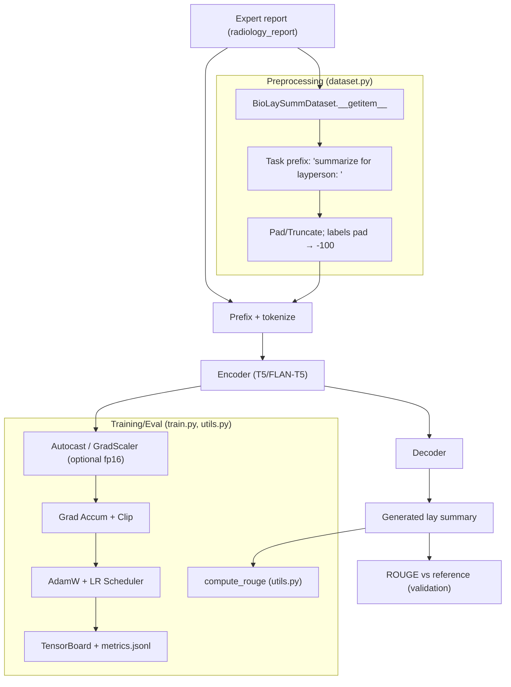
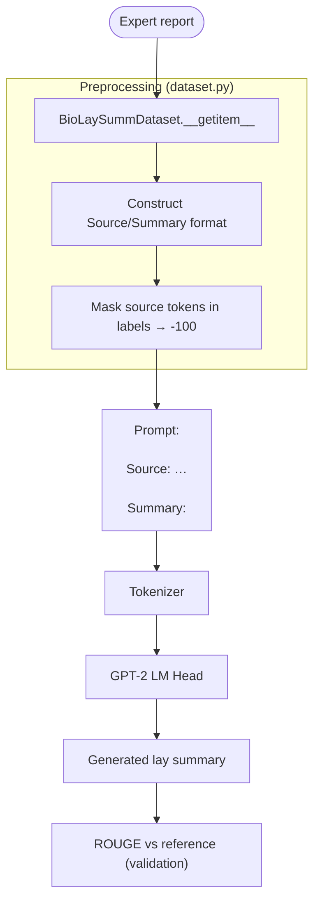
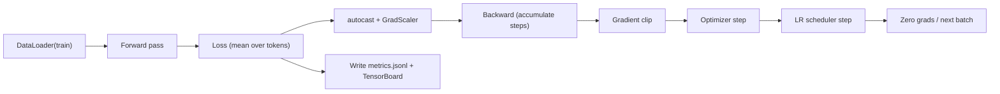
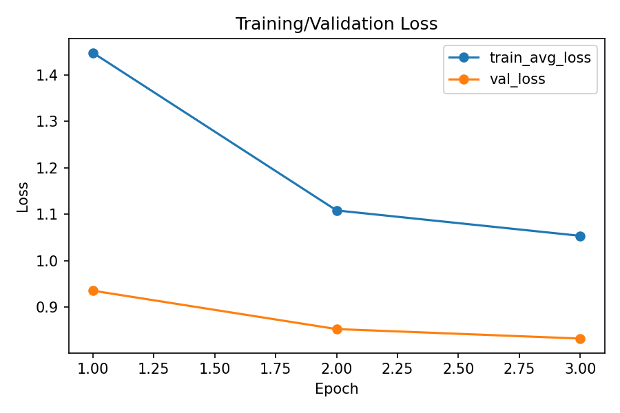
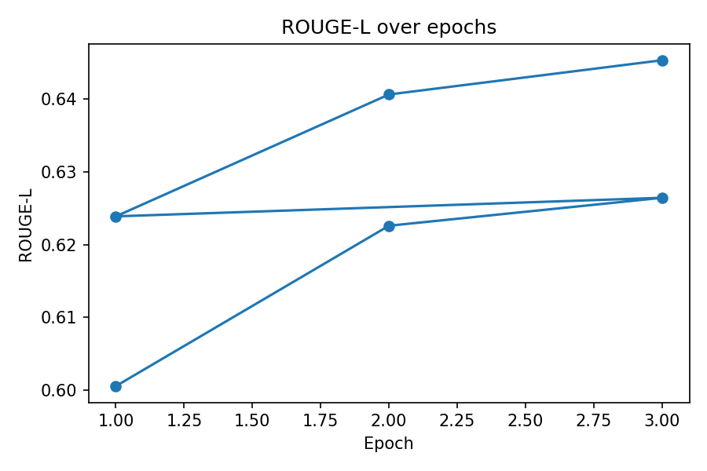
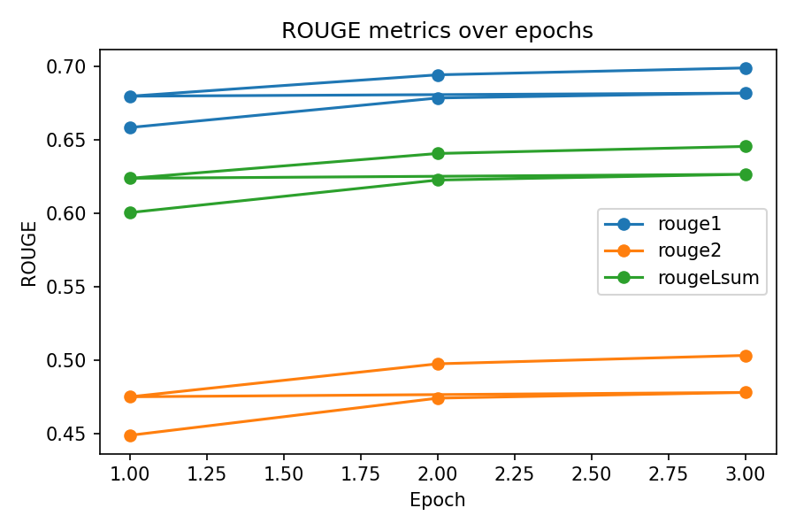

# Expert Radiology Report to Layperson Summary (BioLaySumm)
This project fine‑tunes a pretrained language model to translate expert radiology reports into layperson summaries using the BioLaySumm dataset (ACL 2025). It supports encoder–decoder models like T5/FLAN‑T5 [Raffel et al., 2020; Chung et al., 2022], and decoder‑only models like GPT‑2 (prompted summarization). Evaluation uses ROUGE [Lin, 2004]. Parameter‑efficient fine‑tuning is available via LoRA [Hu et al., 2022].

## Models Supported
- Encoder–decoder (recommended)
    - FLAN‑T5: `google/flan-t5-small`, `google/flan-t5-base`, `google/flan-t5-large`
    - T5: `t5-small`, `t5-base`, `t5-large`
- Decoder‑only (prompted summarization)
    - GPT‑2 family: `gpt2`, `gpt2-medium` (requires source & summary prompting)
- Parameter‑efficient fine‑tuning (optional)
    - LoRA via PEFT (`--lora_r 8` etc.), to reduce trainable parameters and VRAM usage

## Model Architecture 
Encoder–decoder (T5/FLAN‑T5):
- Input to encoder: "summarize for layperson: " + radiology_report
- Decoder generates the lay summary. Labels mask padding tokens with −100 for loss.
Decoder‑only (GPT‑2):
- Prompt: "Source: <report>\n\nSummary: " (no target in prompt at inference)
- Labels mask the source tokens (−100) so loss applies only to the summary span.

Conceptual flow:


### Detailed architecture and code map
Below are implementation‑level diagrams including exact file/function pointers for clarity.
#### Encoder–decoder pipeline (T5/FLAN‑T5)


#### Decoder‑only pipeline (GPT‑2)



For masking details we pad tokens in labels are set to −100 so the loss ignores them; in GPT‑2, all “Source:” tokens are masked to −100; only the “Summary:” span contributes to loss.

#### Training loop anatomy



The decoding strategies (and where its set):
- Beam search: `--eval_num_beams` in `train.py` and `--num_beams` in `predict.py` forwarded to `model.generate`.
- Max output length: `--eval_max_new_tokens`/`--max_new_tokens`.

#### LoRA integration
Can be enabled by passing `--lora_r` (and optional `--lora_alpha`, `--lora_dropout`) into `train.py`. Applied in `modules.py::prepare_model_for_training(...)` via PEFT, adapting attention/FFN modules per backbone defaults while keeping base weights frozen for efficiency.

### Figures and diagrams
- Generated training figures are copied to a stable documentation folder at `recognition/LLMFineTuning/assets/`:
    - `assets/loss.png`
    - `assets/rougeL.png`
    - `assets/rouge_all.png`

## File & Folder Overview
- `runs/`: stores trained models and metrics.
    - `<project>/best`: epoch with model and metrics that produced best loss value or ROUGE (depending on `train.py` input arguments).
    - `<project>/epochK`: checkpoint model and metrics of epoch K.
- `dataset.py`: load and preprocess dataset.
    - `BioLaySummDataset.__getitem__`: builds encoder inputs with prefix and target labels; masks pad tokens to −100 so they’re ignored by loss.
    - `get_dataloaders(...)`: returns train/val/test DataLoaders.
- `modules.py`: script containing all modules used to build networks.
    - `load_model_and_tokenizer(...)`: loads model/tokenizer; sets pad token for GPT‑2; can enable grad checkpointing/8‑bit.
    - `prepare_model_for_training(...)`: applies LoRA/freezing when requested.
    - `create_optimizer(...)`, `create_scheduler(...)`: AdamW + linear/cosine schedule.
- `train.py`: start a fine-tuning loop on LLM.
    - Training loop with optional mixed precision, gradient accumulation/clipping, checkpointing to `runs/<project>/`.
    - Writes `metrics.jsonl`, per‑epoch `epochK/metrics.json`, `training_summary.json` and TensorBoard logs under `runs/<project>/tb`.
- `utils.py`
    - `format_input_text(...)`: constructs the task‑prefixed input for inference.
    - `decode_labels(...)`: converts −100 back to pad for decoding references.
    - `compute_rouge(...)`: decoding + Evaluate(ROUGE) with FP16 safety.
- `plots.py`: turns `metrics.jsonl` into `loss.png`, `rougeL.png`, `rouge_all.png`.

## Dataset (Hugging Face)
The `BioLaySumm/BioLaySumm2025-LaymanRRG-opensource-track` dataset is automatically downloaded using the Hugging Face library. Data loading is handled in `dataset.py` via `load_dataset()` function. More details:
- Fields used:
    - Source (expert): `radiology_report`
    - Target (lay): `layman_report`
- Splits: `train`, `validation`, `test` (used as‑is for clean comparison and unbiased evaluation).

Pre‑processing steps taken:
- Encoder–decoder: prepend task prefix, truncate/pad to `max_source_length`/`max_target_length`, and set label pads to −100.
- Decoder‑only: construct "Source: ...\n\nSummary: ...<eos>", mask source and pad tokens to −100 in labels.

## Setup
PowerShell (Windows):
```powershell
cd recognition\LLMFineTuning
python -m venv .venv
.\.venv\Scripts\Activate
python -m pip install -r .\requirements.txt
```

Bash (Linux/macOS):
```bash
cd recognition/LLMFineTuning
python -m venv .venv
source .venv/bin/activate
python -m pip install -r ./requirements.txt
```

Consider installing CUDA-enabled PyTorch using:
```bash
python -m pip install torch --index-url https://download.pytorch.org/whl/cu121
```

## Train

Full fine‑tune on FLAN‑T5 base (example paths use `recognition/LLMFineTuning/runs/<project-name>/`):

Windows (PowerShell):
```powershell
python .\train.py `
        --model_name google/flan-t5-base `
        --output_dir .\runs\<project-name> `
        --epochs 3 `
        --batch_size 8 `
        --max_source_length 512 `
        --max_target_length 256 `
        --eval_num_beams 4 `
        --eval_max_new_tokens 128
```

Linux/macOS:
```bash
python ./train.py \
        --model_name google/flan-t5-base \
        --output_dir ./runs/<project-name> \
        --epochs 3 \
        --batch_size 8 \
        --max_source_length 512 \
        --max_target_length 256 \
        --eval_num_beams 4 \
        --eval_max_new_tokens 128
```

LoRA (parameter‑efficient): add e.g. `--lora_r 8` (and optionally `--lora_alpha 32 --lora_dropout 0.1`).

Outputs
- Best checkpoint: `runs/<project>/best/`
- Per‑epoch checkpoints: `runs/<project>/epochK/`
- Metrics: `runs/<project>/metrics.jsonl`, `runs/<project>/epochK/metrics.json`
- Training summary (GPU, VRAM, epochs, total time, strategy): `runs/<project>/training_summary.json`
- If enabled, test metrics at end of epoch(s): `runs/<project>/test_metrics.json` and `runs/<project>/best/test_metrics.json`
    - Note: `runs/<project>/test_metrics.json` may end up with 0 scores if there are no references.

## Evaluate and sample predictions
Evaluate a checkpoint on a split and save samples (example uses `runs/<project-name>`):

Windows (PowerShell):
```powershell
python .\predict.py `
        --model_path .\runs\<project-name>\best `
        --split test `
        --batch_size 8 `
        --num_beams 4 `
        --max_new_tokens 128 `
        --samples 5 `
        --metrics_out .\runs\<project-name>\test_metrics.json `
        --samples_out .\runs\<project-name>\pred_samples.jsonl
```

Linux/macOS:
```bash
python ./predict.py \
        --model_path ./runs/<project-name>/best \
        --split test \
        --batch_size 8 \
        --num_beams 4 \
        --max_new_tokens 128 \
        --samples 5 \
        --metrics_out ./runs/<project-name>/test_metrics.json \
        --samples_out ./runs/<project-name>/pred_samples.jsonl
```

`predict.py` prints a JSON block (ROUGE, parameter counts, generation args) and prints/saves a few Source/Pred/Ref examples.

## TensorBoard (live metrics)
Training writes event logs to `runs/<project>/tb`.

- Windows (PowerShell):
        ```powershell
        tensorboard --logdir .\runs\<project-name>\tb --port 6006
        ```
- Linux/macOS:
        ```bash
        tensorboard --logdir ./runs/<project-name>/tb --port 6006
        ```

- train/loss, train/lr over steps
- val/loss and val/ROUGE per epoch
- (if enabled) test/ROUGE metrics

## Plots and figures

Generate static plots from `metrics.jsonl`:

Windows:
```powershell
python .\plots.py --run_dir .\runs\<project-name> --out_dir .\runs\<project-name>\figures
```
Linux/macOS:
```bash
python ./plots.py --run_dir ./runs/<project-name> --out_dir ./runs/<project-name>/figures
```

Saves `loss.png`, `rougeL.png`, and `rouge_all.png`; note that they are also saved to `assets/`.

## Reproducibility
For reproducibiity, a fixed seed is used by default (`--seed 42`), but perfect determinism across machines/GPUs is not guaranteed. The same model/tokenizer and lengths are used across train/eval; environment is also recorded.

## Example Results
```bash
python ./train.py \
  --model_name google/flan-t5-base \
  --output_dir ./runs/project13 \
  --epochs 3 \
  --batch_size 6 \
  --max_source_length 512 \
  --max_target_length 256 \
  --eval_num_beams 4 \
  --eval_max_new_tokens 128 \
  --eval_test_after_train \
  --lora_r 8

python ./predict.py \
  --model_path ./runs/project13/best \
  --split validation \
  --batch_size 8 \
  --num_beams 4 \
  --max_new_tokens 128 \
  --samples 5 \
  --metrics_out ./runs/project13/test_metrics.json \
    --samples_out ./runs/project13/pred_samples.jsonl \
    --base_model_name google/flan-t5-base

python ./plots.py --run_dir ./runs/project13 --out_dir ./runs/project13/figures
```

## Results (project13)

Validation (best checkpoint: `runs/project13/best`, epoch 3):
- rouge1: 0.6989
- rouge2: 0.5034
- rougeL: 0.6454
- rougeLsum: 0.6455

Environment (from `training_summary.json`):
- Model: google/flan-t5-base (encoder–decoder)
- Fine‑tuning: PEFT LoRA (r=8)
- GPU: NVIDIA GeForce RTX 4070 Ti (usable VRAM ~11.57 GB)
- Epochs: 3
- Total training time: ~31,173 sec (~8.7 hours)

Note on splits: Some leaderboard test splits don’t include references, so ROUGE can be 0.0. For reporting and examples, use the validation split [Lin, 2004].

### Figures







## Qualitative examples

Below are samples from a recent evaluation run. Where references are not available (e.g., test split), only Source and Prediction are shown.

1) Example
    - Source (trunc.): “Marked cardiomegaly. Nasogastric tube in the abdomen.”
    - Prediction: “The heart is enlarged. There is a tube in the stomach.”
    - Reference: (not available for this split)
    - Notes: Accurate simplification; concise phrasing; preserves clinical meaning.

2) Example
    - Source (trunc.): “Radiological improvement compared to the chest X‑ray … no evidence of pulmonary infiltrates or pleural effusion.”
    - Prediction: “The x‑ray shows improvement compared to the previous chest X‑ray, and there are no signs of lung infections or fluid around the lungs.”
    - Reference: (not available for this split)
    - Notes: Good readability; adds minor connective wording; semantics preserved.

3) Example
    - Source (trunc.): “Slight radiological improvement … Tracheostomy cannula in place.”
    - Prediction: “There’s a slight improvement … There’s a breathing tube in place.”
    - Reference: (not available for this split)
    - Notes: Simplifies specific device name (“tracheostomy cannula” → “breathing tube”); acceptable for lay style but less precise.

4) Example
    - Source (trunc.): “Radiological signs of COPD … bilateral apical pleural thickening … CT recommended given history.”
    - Prediction: “The x‑ray shows signs of chronic obstructive pulmonary disease (COPD). There’s thickening at the tops of both lungs, possibly from radiation. A chest CT is recommended given the history.”
    - Reference: (not available for this split)
    - Notes: Preserves key conditions and the CT recommendation; appropriately expands COPD for lay readers.

5) Example
    - Source (trunc.): “Comparison with previous studies … diffuse peripheral opacities … tubes and lines positions … radiological worsening with new consolidation …”
    - Prediction: “Compared to prior imaging, the lungs show widespread cloudiness at the edges. The breathing and feeding tubes appear in place. There’s worsening with new cloudiness in the left lower lobe.”
    - Reference: (not available for this split)
    - Notes: Captures overall trend and device positions; minor wording artifacts remain; could benefit from tighter phrasing.

## Discussion

The encoder–decoder approach (FLAN‑T5) produced strong validation ROUGE (rougeL ≈ 0.65) with a modest compute budget, aligning with prior T5/FLAN‑T5 transfer‑learning results [Raffel et al., 2020; Chung et al., 2022]. LoRA [Hu et al., 2022] enabled efficient adaptation with reduced trainable parameters, which is useful on mid‑range GPUs. Qualitative outputs are readable and mostly faithful, though occasional oversimplification or minor wording artifacts occur. Dataset limitations (e.g., missing references for certain test splits) can mask progress if not evaluated on validation. Future work could incorporate factuality checks, style control, and domain‑specific terminology glossaries; additional metrics beyond ROUGE (e.g., BERTScore) may provide complementary signal.

In this run, validation metrics were still improving at epoch 3, suggesting a few more epochs could yield more gains before plateauing.

## References

- T5: Raffel et al., “Exploring the Limits of Transfer Learning with a Unified Text‑to‑Text Transformer (T5)” (JMLR 2020)
- FLAN‑T5: Chung et al., “Scaling Instruction‑Finetuned Language Models” (arXiv 2022)
- LoRA: Hu et al., “LoRA: Low‑Rank Adaptation of Large Language Models” (ICLR 2022)
- PEFT library: Mangrulkar et al., “PEFT: State‑of‑the‑art Parameter‑Efficient Fine‑Tuning” (Hugging Face, 2023)
- ROUGE: Lin, “ROUGE: A Package for Automatic Evaluation of Summaries” (ACL 2004)
- BioLaySumm dataset: `BioLaySumm/BioLaySumm2025-LaymanRRG-opensource-track` (Hugging Face)
- Transformers: Wolf et al., “Transformers: State‑of‑the‑Art Natural Language Processing” (EMNLP 2020)
- bitsandbytes: Dettmers et al., “8‑Bit Optimizers via Blockwise Quantization” (ICLR 2022)
- Gradient checkpointing: Chen et al., “Training Deep Nets with Sublinear Memory Cost” (arXiv 2016)
